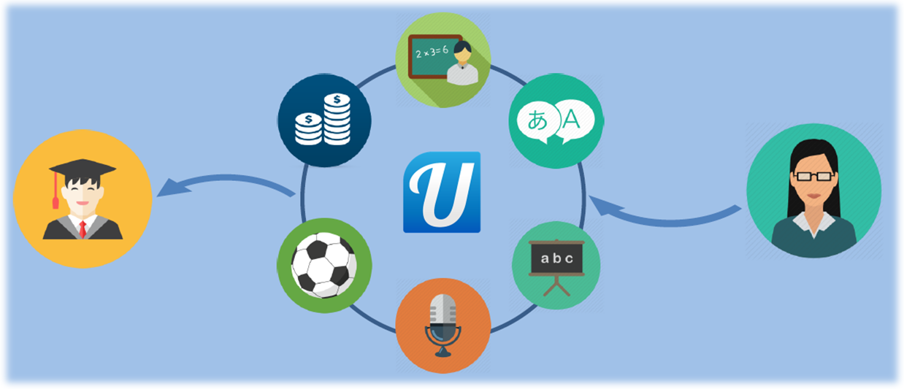

# Ulearn

Ulearn is a new concept platform which aims at connecting people that want to teach with those that want to learn. At the moment it has only been materialized in the form of a mobile app, and we expect to develop soon a website and other forms of online presence. Here we present the present and upcoming features, as well as the first prototype of the app.

## Motivations

A world increasingly connected by the accessibility to information services translates in speed and cost reduction when in need to search for products, goods and services. As a team of passionate engineers attending the NUS Singapore Hack&Roll Hackathon, we observed that, however, private classes (either sporadic or regular) are subject to strong commissions from agencies both inside and outside of Singapore.

With this in mind, we decided to tackle the stated problem by developing an innovative solution: Ulearn, a platform that connects teachers with students by topic and proximity. In this way, the heartbreaking commissions of agencies and the transport times decrease for both students and teachers, resulting in greater flexibility for our users.

	

## Concept

Ulearn takes advantage of the already-established communities:
* Students at school, or university campuses
* Neighbors in our block and district
* Colleagues at work

Besides their jobs and duties, these people have passions and skills that they want to share, practice or master. Through the app and website users will be able to filter by topic (advanced calculus, guitar, languages, magic tricks) and personal preferences (location, schedule, age). Students will also be able to access the descriptions of their potential tutors to see reviews and make an informed choice.

Profit would be obtained from one or more of the following sources:
- Premium services, e.g. one that would allow subscribed teachers to appear first in the search list.
- Small and competitive commissions for the first two sessions.
- Official recognition by the company of the titles and aptitudes of registered tutors.
	
The emergence of Ulearn in the current market would benefit users - both teachers and students – by improving the search dynamics and lowering the price of knowledge transmission.

	
	
	

## What comes next

* Redesign and improve the UI
* *Express service* for students to quickly find available tutors for intensive sessions before academic tests, when time becomes crucial

## Credits

* Software development: Alexis Pomares Pastor
* Business plan: Ignacio Albert Smet
* Design and speech: Paul-Edouard Sarlin, Mudit Gupta and Ignacio Albert Smet
